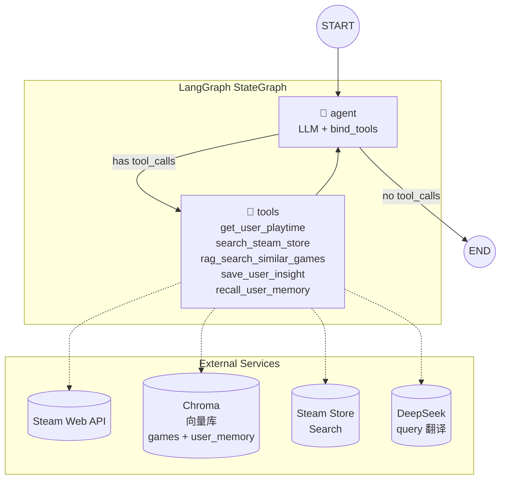

# Steam 游戏推荐 Agent — 技术设计文档

> 状态：DRAFT  
> 最后更新：2026-07-05

---

## 1. 项目背景与目标

基于用户的 Steam 游戏库数据（游玩时长、最近游玩记录），结合语义检索（RAG），构建一个**个性化游戏推荐 Agent 系统**。

这是一个 **Agent 而非固定 workflow**：LLM 需要自主决定工具调用的顺序、次数，根据中间结果动态判断信息是否充分，而不是按照预定义的 if/else 路径执行。例如：

- 用户问"推荐类似我玩过的游戏"→ Agent 先调 `get_user_playtime`，拿到 Top 3 游戏后，再调 `rag_search_similar_games`，根据返回结果判断是否需要进一步调用 `search_steam_store` 补充商店信息。
- 用户问"最近有什么好玩的策略游戏"→ Agent 判断不需要查用户库，直接调 `search_steam_store`，可能再调 `rag_search_similar_games` 补充推荐。

Agent 的核心能力是在 **不确定信息是否充分时继续追问工具，信息充分时直接给出最终回答**。

---

## 2. 系统架构图



**关键设计决策**：

- 基于 **LangGraph `StateGraph`** 手写节点和 conditional edge，**不使用 `create_react_agent` 等预制封装**，以展示对底层机制（消息循环、条件路由判断逻辑）的掌握。
- Agent ↔ Tool 之间形成循环：LLM 每次收到工具返回结果后，重新评估信息是否充分，决定继续调用工具还是结束。
- 条件边 `should_continue` 根据 `last_message` 是否包含 `tool_calls` 做路由。

```python
def should_continue(state: AgentState) -> Literal["tools", "__end__"]:
    messages = state["messages"]
    last_message = messages[-1]
    if hasattr(last_message, "tool_calls") and last_message.tool_calls:
        return "tools"
    return "__end__"
```

---

## 3. State 设计

```python
from typing import TypedDict, Annotated, Sequence
from langchain_core.messages import BaseMessage
from langgraph.graph.message import add_messages


class AgentState(TypedDict):
    messages: Annotated[Sequence[BaseMessage], add_messages]
    steam_id: str | None
    user_id: str
```

| 字段 | 类型 | 说明 |
|---|---|---|
| `messages` | `Annotated[Sequence[BaseMessage], add_messages]` | 对话历史，使用 LangGraph 内置的 `add_messages` reducer，新消息自动追加（不会覆盖历史）。这是 Agent 循环的核心状态 |
| `steam_id` | `str \| None` | 用户的 Steam 64 位 ID，由前端传入。`None` 表示匿名用户（未绑定 Steam） |
| `user_id` | `str` | 系统用户 ID，用于关联长期记忆（user_insights 表、对话历史向量检索） |

**设计说明**：

- `add_messages` reducer 保证每次 LLM 调用和工具调用的消息都累积在 `messages` 列表中，形成完整的推理链。
- `steam_id` 可为 `None`：匿名用户时 Agent 仍需能提供通用推荐，并在适当时机引导用户绑定 Steam。
- `user_id` 与 `steam_id` 分离：`user_id` 是系统内部标识，`steam_id` 是 Steam 平台标识。一个 `user_id` 对应一个 `steam_id`，但允许 `steam_id` 为空。
- 后续可扩展字段：`session_summary: str`（长对话摘要，用于 memory）。

---

## 4. 工具设计

### 4a. `get_user_playtime`

```python
def get_user_playtime(steam_id: str, count: int = 10) -> dict:
    """
    获取指定 Steam 用户的游戏时长和游玩历史。

    适用场景：
    - 用户说"推荐我玩过的类似游戏"、"根据我的库推荐"
    - 用户说"我平时玩什么类型的游戏"（需先了解用户偏好时）
    - Agent 判断需要了解用户偏好才能做个性化推荐时

    注意：此工具需要用户的 Steam ID。如果当前 State 中没有 steam_id，
    应先引导用户提供或绑定 Steam 账号。

    Args:
        steam_id: Steam 64 位用户 ID（如 7656119XXXXXXXXXX）
        count: 返回的游戏数量，默认 10

    Returns:
        {
            "games": [
                {
                    "appid": 730,
                    "name": "Counter-Strike 2",
                    "playtime_forever": 1523,      # 总游玩分钟数
                    "playtime_2weeks": 340,         # 近两周游玩分钟数
                    "img_icon_url": "xxx.ico"
                },
                ...
            ],
            "total_game_count": 42
        }
    """
```

**内部实现逻辑**：

1. 调用 Steam Web API `IPlayerService/GetOwnedGames`（参数 `include_appinfo=true`, `include_played_free_games=true`），获取用户拥有的全部游戏及总时长。
2. 按 `playtime_forever` 降序排列，取前 `count` 个。
3. 可选：调用 `IPlayerService/GetRecentlyPlayedGames` 获取最近两周游玩记录，补充 `playtime_2weeks` 字段。
4. 需要 Steam Web API Key（环境变量 `STEAM_API_KEY`）。

**适用场景**：当 LLM 判断用户意图是个性化推荐、需要了解用户口味时调用。如果用户只是泛泛地问"最近有什么好游戏"，不调用此工具。

---

### 4b. `search_steam_store`

```python
def search_steam_store(query: str, max_results: int = 10) -> dict:
    """
    按名称或标签搜索 Steam 商店中的游戏。

    适用场景：
    - 用户说"最近有什么好玩的FPS游戏"（按类型搜索）
    - 用户说"有没有类似 Elden Ring 的游戏"（按名称搜索）
    - 用户在 RAG 推荐了游戏 A 后，想确认 A 是否在售、价格、评价
    - 用户明确提到了某个游戏名或类型关键词时

    注意：此工具搜索的是 Steam 商店当前在售游戏，不包含已下架游戏。
    如果需要语义层面的"相似推荐"，优先使用 rag_search_similar_games。

    Args:
        query: 搜索关键词（游戏名称或类型标签，如 "RPG"、"Elden Ring"）
        max_results: 返回的最大结果数，默认 10

    Returns:
        {
            "results": [
                {
                    "appid": 1245620,
                    "name": "Elden Ring",
                    "price": {"currency": "CNY", "final": 29800},
                    "metacritic": 94,
                    "tags": ["Souls-like", "Open World", "Action RPG"],
                    "header_image": "https://cdn.akamai.steamstatic.com/...",
                    "short_description": "..."
                },
                ...
            ]
        }
    """
```

**内部实现逻辑**：

1. 调用 Steam Store Search API（`https://store.steampowered.com/api/storesearch/?term={query}&l=zh`），获取匹配的 appid 列表。
2. 对每个 appid 调用 `appdetails` 接口（`https://store.steampowered.com/api/appdetails?appids={appid}`），提取：名称、`price_overview`（价格）、`metacritic.score`、`genres`、`short_description`。
3. 每个搜索返回的 appid 都会触发一次 `appdetails` 请求。为防止某次搜索产生过多请求，实际实现中可限制并行请求数（如 `asyncio.Semaphore(5)`）。
4. 不引入第三方 API（SteamSpy 等）。官方 API 已能覆盖价格、评分、类型，满足 Agent 对商店信息的所有需求。社区标签（Souls-like 等）由 RAG 知识库覆盖。

**适用场景**：当用户明确想知道某类游戏或某个具体游戏时调用。与 RAG 工具的区别：此工具返回的是**实时商店数据**（价格、评价），而非语义相似的推荐。

---

### 4c. `rag_search_similar_games`

```python
def rag_search_similar_games(
    query: str,
    top_k: int = 5,
    filter_tags: list[str] | None = None
) -> dict:
    """
    基于语义相似度，从本地游戏知识库中检索与查询描述最匹配的游戏。

    适用场景：
    - "推荐类似 Hollow Knight 的游戏"（以游戏名作为语义锚点检索）
    - "我喜欢剧情驱动的RPG，有什么推荐"（以自然语言描述检索）
    - 用户已玩过游戏 A、B、C，需要找"风格相似但没玩过的游戏"
    - 任何需要"深度理解游戏内容相似度"的场景，而非简单的标签匹配

    此工具搜索的是预构建的游戏知识库（包含简介、标签、评测），
    因此可以捕捉到标签无法表达的语义关联（如"类银河城"与"平台探索"）。

    如果还需要知道推荐结果的价格、是否在售，请额外调用 search_steam_store。

    Args:
        query: 自然语言查询，可以是游戏名或描述，如 "Hollow Knight 类似的独立游戏"
        top_k: 返回的最相似游戏数量，默认 5
        filter_tags: 可选的标签过滤列表，如 ["RPG", "Open World"]。
                     当提供时，先按标签过滤再计算向量相似度（混合检索）

    Returns:
        {
            "results": [
                {
                    "appid": 367520,
                    "name": "Hollow Knight",
                    "similarity_score": 0.92,
                    "description": "...",
                    "tags": ["Metroidvania", "Action", "Indie"],
                    "review_summary": "好评如潮, 手感极佳..."
                },
                ...
            ]
        }
    """
```

**内部实现逻辑**：

1. **Query 翻译**：如果输入 `query` 包含中文字符，调用 `deepseek-chat` 将其翻译为英文（轻量 prompt："Translate the following game-related query into English. Only output the translation, nothing else: {query}"）。这是为了弥合中文 query 与英文知识库之间的语言鸿沟。
2. 将英文 query 通过 `all-MiniLM-L6-v2` 转为 embedding 向量。
3. 如果 `filter_tags` 不为空，在 Chroma 中先按 `tags` 字段做 metadata filter（`where={"tags": {"$in": filter_tags}}`），再在筛选结果上做向量相似度检索。
4. 否则直接在全集上做 ANN 检索，返回 `top_k` 条结果。
5. 每条结果附带元数据（appid、名称、标签、简介、评测摘要）。

**适用场景**：当 LLM 判断用户需求是"找相似游戏"而非"查商店信息"时调用。这是 Agent 的核心推荐能力，RAG 检索作为 tool 被 LLM 按需触发，而非每次请求都跑一遍。

---

### 4d. `save_user_insight`

```python
def save_user_insight(
    user_id: str,
    insight: str,
    category: Literal["preference", "constraint", "fact"],
    action: Literal["add", "remove"] = "add"
) -> str:
    """
    将对话中发现的用户偏好、约束或个人事实持久化保存，供后续跨会话使用。

    适用场景（Agent 应在发现以下信息时主动调用）：
    - 用户表达了明确的游戏偏好（"我最喜欢Roguelike"、"我讨厌恐怖游戏"）
    - 用户提到了约束条件（"我每天只能玩半小时"、"预算不超过100元"、"我晕3D"）
    - 用户透露了个人事实（"我有一台Steam Deck"、"我在日区"、"我是魂系老玩家"）
    - 用户明确要求记住某事（"记住我喜欢像素风"）
    - 用户推翻了之前的偏好（"其实我现在不讨厌策略游戏了"）→ 用 action="remove"

    这些洞察会在后续新会话的 System Prompt 中注入，实现跨会话个性化。

    Args:
        user_id: 系统用户 ID
        insight: 要保存的洞察，用自然语言描述，如 "用户不喜欢恐怖游戏，觉得太吓人"
        category:
            - "preference": 喜好（喜欢/讨厌的游戏类型、风格、玩法）
            - "constraint": 约束（时间、预算、硬件、身体条件）
            - "fact": 个人事实（设备、区服、游戏阅历、身份）
        action:
            - "add": 新增此洞察
            - "remove": 撤销/删除之前的某条洞察

    Returns:
        确认信息
    """
```

**内部实现逻辑**：

1. 写入 `user_insights` 表（SQLite，字段：`id`, `user_id`, `insight`, `category`, `created_at`）。
2. 如果 `action="remove"`，按 `user_id + insight` 精确匹配删除。
3. 返回确认信息给 LLM，LLM 可用自然语言告知用户"已记住"。

**设计理念**：由 Agent 自主判断何时调用，而非每轮对话后自动提取。Agent 在对话上下文中最清楚什么值得记、怎么记，后台自动提取反而容易产生噪音。

---

### 4e. `recall_user_memory`

```python
def recall_user_memory(
    user_id: str,
    query: str,
    top_k: int = 5
) -> dict:
    """
    从用户的历史对话记忆中检索相关的对话片段。

    适用场景：
    - 用户提到很久以前聊过的话题（"上次你推荐的那个游戏我玩了"）
    - Agent 需要回顾用户过去表达过但未被 save_user_insight 显式记录的偏好
    - 用户问"我们之前聊过什么"
    - 需要补充上下文来理解用户当前模糊的表述

    注意：此工具检索的是历史对话原文片段，而非结构化画像。
    结构化画像已自动注入 System Prompt，无需主动调用。

    Args:
        user_id: 系统用户 ID
        query: 检索查询，用自然语言描述想回忆什么，如 "用户之前聊过的Roguelike游戏"
        top_k: 返回的最相关记忆片段数，默认 5

    Returns:
        {
            "memories": [
                {
                    "content": "用户: 我最近在玩Hades，感觉超级上瘾...",
                    "timestamp": "2026-06-15T14:30:00",
                    "thread_id": "th_abc123",
                    "similarity_score": 0.87
                },
                ...
            ]
        }
    """
```

**内部实现逻辑**：

1. 与 `rag_search_similar_games` 共用 Chroma 实例，使用独立的 `user_memory` collection。
2. 每轮对话结束时，将本轮用户消息 + Agent 回复拼接为文本段，embedding 后写入 `user_memory` collection（metadata 中记录 `thread_id`、`timestamp`）。
3. 检索时按 `query` 做向量相似度搜索，返回 top_k 条历史对话片段。

**与 `save_user_insight` 的关系**：
- `save_user_insight`：精炼后的结构化画像，自动注入 System Prompt，免费获取
- `recall_user_memory`：原始对话片段，需要 Agent 主动检索，有 token 成本
- 两者互补：画像覆盖"已知偏好"，记忆检索覆盖"模糊回忆"

---

## 5. RAG 设计

### 5.1 离线阶段

**数据来源**：

| 来源 | 内容 | 获取方式 |
|---|---|---|
| Steam Top 250 / 热门游戏列表 | 游戏 appid、名称 | 爬虫 / 公开数据集 |
| Steam Store `appdetails` API | 游戏简介（short_description）、类型标签（tags）、开发者、发行商 | Steam Web API |
| Steam 评测摘要 | 好评率、评测关键词（从用户评测中提取的高频词） | Steam 评测 API 或 NLP 抽取 |

**Chunk 策略**：以**单个游戏为最小语义单元**。每个 chunk 拼接如下字段：

```
【游戏名】Hollow Knight
【简介】一款经典的2D动作冒险游戏，设定在广阔互联的地下王国...
【标签】Metroidvania, Action, Indie, Platformer, Souls-like
【评测关键词】手感极佳, 地图设计精妙, 难度较高, 氛围出色
```

这样每个 embedding 向量代表一个完整游戏的语义画像，chunk 粒度与业务实体一一对应，查询时不会出现"片段的片段"问题。

**Embedding 模型选型**：`all-MiniLM-L6-v2`（sentence-transformers）。

- 轻量级（~80MB），CPU 可本地运行，零 API 成本。
- 英文专精，与英文游戏知识库匹配。
- 用户中文 query 通过 `deepseek-chat` 在 `rag_search_similar_games` 工具内部翻译为英文后再 embedding，弥合语言鸿沟。

**向量库选型**：**Chroma**，本地持久化。两个 collection：

| Collection | 用途 | 写入时机 |
|---|---|---|
| `games` | 游戏知识库（离线摄入） | 离线 ingest 脚本 |
| `user_memory` | 用户历史对话片段（在线写入） | 每轮对话结束后 |

**混合检索**：支持，通过在 Chroma 查询时传入 `where` 条件实现。例如用户说"类似 Hollow Knight 的独立游戏"，LLM 可将"独立"识别为标签约束，调用 `rag_search_similar_games` 时传入 `filter_tags=["Indie"]`。

### 5.2 在线阶段

```
User: "推荐类似 Hollow Knight 但难度低一点的游戏"
        │
        ▼
Agent (LLM) 思考: 需要语义检索 → 调用 rag_search_similar_games
        │
        ▼
rag_search_similar_games(query="Hollow Knight 低难度 Metroidvania", top_k=5)
        │  (过滤掉用户已拥有的游戏—可选)
        ▼
返回 Top 5 相似游戏 → 拼接进 LLM 上下文
        │
        ▼
Agent (LLM) 判断: 信息充分？→ 补充商店价格？→ 最终推荐
```

**关键设计**：RAG 检索是作为一个 **tool** 被 LLM 按需调用的，而不是每次用户请求都无条件触发。例如用户说"帮我查一下 CS2 多少钱"，Agent 就不会调 RAG，只会调 `search_steam_store`。

检索结果通过 `ToolMessage` 返回，自动拼入 `messages` 历史，LLM 在下一轮推理时能看到完整的检索结果。

### 5.3 用户对话记忆归档

每轮对话结束后，后台异步执行：

```
本轮 user messages + agent reply
        │
        ▼
拼接为文本段 → all-MiniLM-L6-v2 → embedding
        │
        ▼
写入 Chroma user_memory collection（metadata: user_id, thread_id, timestamp）
```

Agent 在后续对话中可通过 `recall_user_memory` tool 检索这些历史片段。此流程对用户透明，不阻塞对话响应。

---

## 6. Prompt 设计

System Prompt 的核心思想是引导 LLM 做 **显式的 ReAct 式推理**：

```text
你是一个 Steam 游戏推荐助手。你可以使用以下工具来帮助用户找到适合的游戏：

1. get_user_playtime — 获取用户的 Steam 游戏库和游玩时长
2. search_steam_store — 搜索 Steam 商店中的游戏（名称/价格/标签）
3. rag_search_similar_games — 基于语义相似度检索相似游戏
4. save_user_insight — 保存用户偏好/约束/个人信息（跨会话持久化）
5. recall_user_memory — 检索用户的历史对话记忆

## 推理规则

在每次回复前，请按以下步骤思考：

1. **分析用户意图**：用户想要什么？个性化推荐 / 发现新游戏 / 查某个游戏的信息 / 回顾之前聊过的话题？
2. **判断信息缺口**：我还缺什么信息才能给出好答案？
   - 缺用户偏好 → 调 get_user_playtime
   - 缺相似游戏 → 调 rag_search_similar_games
   - 缺商店信息（价格/在售状态）→ 调 search_steam_store
   - 缺历史对话上下文 → 调 recall_user_memory
3. **一次只调用必要的工具**：不要一口气调用所有工具。先调用最关键的，拿到结果后再判断是否需要更多信息。
4. **信息充分后立即作答**：当你认为信息足够给出推荐时，直接回复用户，不要再调用工具。
5. **主动记住用户**：当用户在对话中表达了明确的偏好、约束或个人事实时，主动调用 save_user_insight 保存。不要等用户要求你记住。

## 推荐原则

- 优先推荐用户库中游玩时间长的类型的相似游戏
- 推荐的游戏要说明推荐理由（与用户已有游戏的关联、评分、特色）
- 如果用户是泛需求（"推荐好玩的"），结合其偏好给出有依据的建议
```

【待确认】是否需要增加 few-shot examples 在 System Prompt 中？few-shot 能显著提升工具调用的准确性，但会增加 token 消耗。

---

## 7. FastAPI 部署设计

### 7.1 接口设计

| 接口 | 方法 | 说明 |
|---|---|---|
| `/chat` | POST | 同步对话，返回完整响应 |
| `/chat/stream` | POST | SSE 流式对话，逐 token 返回 |
| `/health` | GET | 健康检查 |

### 7.2 请求/响应 Schema

```python
from pydantic import BaseModel


class ChatRequest(BaseModel):
    thread_id: str                        # 会话 ID，用于多轮对话
    user_id: str                          # 系统用户 ID，用于长期记忆
    message: str                          # 用户消息
    steam_id: str | None = None           # Steam ID（首次对话时传入）


class ChatResponse(BaseModel):
    thread_id: str
    reply: str
    tool_calls_made: list[str] = []       # 本次使用了哪些工具


class StreamEvent(BaseModel):
    event: str                            # "token" | "tool_call" | "done"
    data: str                             # token 内容 / 工具名 / 最终完整回复
```

### 7.3 多轮对话管理

使用 **LangGraph Checkpointer** 持久化对话状态：

- **开发/单机阶段**：`SqliteSaver`（`langgraph.checkpoint.sqlite`），本地 sqlite 文件存储，零配置。
- **生产阶段预留**：`PostgresSaver`（`langgraph.checkpoint.postgres`），通过 `asyncpg` 连接 PostgreSQL。代码中通过依赖注入切换：

```python
def get_checkpointer(env: str = "dev") -> BaseCheckpointSaver:
    if env == "production":
        return AsyncPostgresSaver.from_conn_string(DATABASE_URL)
    return SqliteSaver.from_conn_string("checkpoints.db")
```

**thread_id 机制**：前端每次请求携带 `thread_id`，后端从 checkpointer 中加载对应 State，执行 graph 后再保存。不同 `thread_id` 之间的对话完全隔离。

### 7.4 流式响应（SSE）

```python
@router.post("/chat/stream")
async def chat_stream(req: ChatRequest):
    async def event_generator():
        config = {"configurable": {"thread_id": req.thread_id}}
        async for event in graph.astream_events(
            {"messages": [HumanMessage(content=req.message)], "steam_id": req.steam_id},
            config,
            version="v2",
        ):
            if event["event"] == "on_chat_model_stream":
                yield f"data: {json.dumps({'event': 'token', 'data': event['data']['chunk'].content})}\n\n"
            elif event["event"] == "on_tool_start":
                yield f"data: {json.dumps({'event': 'tool_call', 'data': event['name']})}\n\n"
        yield "data: {\"event\": \"done\", \"data\": \"\"}\n\n"

    return StreamingResponse(event_generator(), media_type="text/event-stream")
```

---

## 8. 目录结构建议

```
steam_agent/
├── api/
│   ├── __init__.py
│   ├── main.py                  # FastAPI app 入口
│   ├── routes.py                # /chat, /chat/stream 路由
│   └── schemas.py               # Pydantic 模型
│
├── graph/
│   ├── __init__.py
│   ├── state.py                 # AgentState 定义
│   ├── builder.py               # StateGraph 构建（节点 + 条件边）
│   └── nodes.py                 # agent_node, tool_node 实现
│
├── tools/
│   ├── __init__.py
│   ├── playtime.py              # get_user_playtime
│   ├── store_search.py          # search_steam_store
│   ├── rag_search.py            # rag_search_similar_games
│   ├── user_insight.py          # save_user_insight
│   └── user_memory.py           # recall_user_memory
│
├── memory/
│   ├── __init__.py
│   ├── insight_store.py         # user_insights 表 CRUD
│   └── archiver.py              # 对话归档到 Chroma user_memory collection
│
├── rag/
│   ├── __init__.py
│   ├── embedder.py              # all-MiniLM-L6-v2 封装
│   ├── translate.py             # deepseek-chat query 翻译
│   ├── vector_store.py          # Chroma 读写封装
│   ├── ingest.py                # 离线数据摄入脚本
│   └── data/                    # Chroma 持久化目录（games + user_memory）
│
├── prompts/
│   ├── __init__.py
│   └── system.py                # System Prompt 模板（含用户画像注入逻辑）
│
├── config.py                    # 环境变量、LLM 配置、Steam API Key
├── requirements.txt
├── checkpoints.db               # SqliteSaver 持久化文件（dev 阶段）
├── DESIGN.md                    # 本文档
└── README.md
```

---

## 9. 可观测性 — LangSmith 集成

使用 **LangSmith** 追踪每次 Agent 调用的完整链路：

```python
# 通过环境变量启用
# LANGCHAIN_TRACING_V2=true
# LANGCHAIN_API_KEY=ls__...
# LANGCHAIN_PROJECT=steam-agent

# 或在代码中设置
from langsmith import Client
client = Client()
```

**追踪内容**：

- 每次 Graph 运行的完整生命周期（延迟、token 消耗）
- 每个节点的输入/输出（agent_node 的 prompt、tool_node 的调用参数和返回值）
- 工具调用的参数、返回结果、耗时
- LLM 推理的 token 用量和费用
- 错误堆栈（工具调用失败、API 超时等）

**使用场景**：

- 开发阶段：调试 Agent 为什么调了某个工具、为什么循环了 N 次才停止
- 上线后：监控推荐质量、发现工具调用异常、优化 prompt

【待确认】LangSmith 的 self-hosted 版本 vs SaaS 版本的选择？SaaS 免费层有 tracing 条数限制，self-hosted 需要自行部署。

**选择**：LangSmith SaaS 免费版（app.langchain.com），零运维开箱即用。免费层约 3k traces/月，开发阶段足够。后续若不够再考虑升级或 self-hosted。

---

## 10. 决策汇总

所有开放问题已确认完毕。

| # | 问题 | 决策 |
|---|---|---|
| 1 | Embedding 模型 | `all-MiniLM-L6-v2` + `deepseek-chat` 翻译 |
| 2 | Steam Store 数据源 | 仅官方 API + `appdetails` |
| 3 | Steam API 缓存 | 不缓存 |
| 4 | 长短期 Memory | `save_user_insight` tool + 全量对话入 Chroma |
| 5 | 匿名用户流程 | 渐进式引导（先通用推荐，需要时再引导绑定） |
| 6 | 混合检索策略 | 工具内部自动提取标签做 filter，结合向量检索 |
| 7 | few-shot examples | 加 2 个示例（链式调用 + 直接回答） |
| 8 | LLM 选型 | `deepseek-chat`（主推理 + RAG 翻译均用此模型） |
| 9 | LangSmith 部署 | SaaS 免费版（app.langchain.com） |
| 10 | RAG 知识库更新 | 手动执行 `ingest.py`，无需自动定时 |

---

## 已定决策详情

### 决策 1：Embedding 模型

**选择**：`all-MiniLM-L6-v2`（sentence-transformers），轻量本地运行。

**Query 翻译**：`rag_search_similar_games` 工具内部检测中文输入时，调用 `deepseek-chat` 翻译为英文后再 embedding。

### 决策 2：Steam Store 数据源

**选择**：仅使用 Steam 官方 API。搜索接口返回 appid 列表后，通过 `appdetails` 接口获取每个游戏的详细信息（价格、评分、类型）。不引入第三方 API。

### 决策 3：Steam API 缓存

**选择**：不缓存。100k 次/天的限额远高于实际使用量，不需要增加缓存复杂度。

### 决策 4：长短期 Memory

**选择**：两层持久化。

1. **结构化画像**：Agent 通过 `save_user_insight` tool 主动保存用户偏好/约束/事实到 `user_insights` 表（SQLite）。新会话开始时自动注入 System Prompt。
2. **原始对话记忆**：每轮对话结束后，将用户消息 + Agent 回复 embedding 后写入 Chroma `user_memory` collection。Agent 通过 `recall_user_memory` tool 按需检索。

### 决策 5：匿名用户流程

**选择**：渐进式引导。Agent 先正常做通用推荐（用 RAG + 商店搜索），当用户表现出个性化需求（"适合我吗"、"根据我的库"）时，再自然引导用户绑定 Steam，而非一开始就拦截。

实现上不需要额外架构——Agent 已有的"判断信息缺口"逻辑自然覆盖此场景：`steam_id` 为 `None` 意味着无法调 `get_user_playtime`，Agent 会自行应对。

### 决策 6：混合检索策略

**选择**：工具内部自动提取标签做 metadata filter + 向量相似度检索。

流程：
1. 启动时从 Chroma 加载全部可用标签列表，缓存到内存
2. `rag_search_similar_games` 被调用时，用轻量 prompt（deepseek-chat，~900 tokens）从标签列表中匹配 query 中的标签意图
3. 先用匹配到的标签做 `where` filter，再在过滤结果上做向量检索
4. 如果 query 中没有可匹配的标签关键词，跳过 filter 直接纯向量检索

标签列表固定，可被 Prompt Cache 命中，第二次调用开始输入成本大幅降低。`filter_tags` 参数保留，Agent 明确想过滤时可直接传。

### 决策 7：few-shot examples

**选择**：Sysem Prompt 中加入 2 个示例。

示例 1（链式调用，够了就停）：
```
User: "根据我的游戏库，推荐几款类似的游戏"

→ 调用 get_user_playtime(steam_id="...", count=5)
→ 拿到 Hades(800h), Dead Cells...
→ 调用 rag_search_similar_games(query="games similar to Hades and Dead Cells, roguelike action", top_k=5)
→ 拿到 5 个推荐，信息充分
→ 直接回复推荐结果（不额外查商店价格，因为用户没问）
```

示例 2（不需要工具，直接答）：
```
User: "魂系游戏是什么意思？"

→ 用户问的是概念解释，不是推荐
→ 自身知识即可回答，不需要调任何工具
→ 直接回复解释
```

### 决策 8：LLM 选型

**选择**：`deepseek-chat` 统一作为主推理模型和 RAG 翻译模型。

- 成本极低
- 中文原生
- 工具调用能力满足项目需求

### 决策 9：LangSmith 部署

**选择**：SaaS 免费版（app.langchain.com），免费层约 3k traces/月，开发阶段足够。

### 决策 10：RAG 知识库更新

**选择**：手动执行 `ingest.py`。开发阶段不需要自动定时任务，需要更新时手动跑脚本即可。`ingest.py` 同时支持全量重建和增量追加两种模式。
