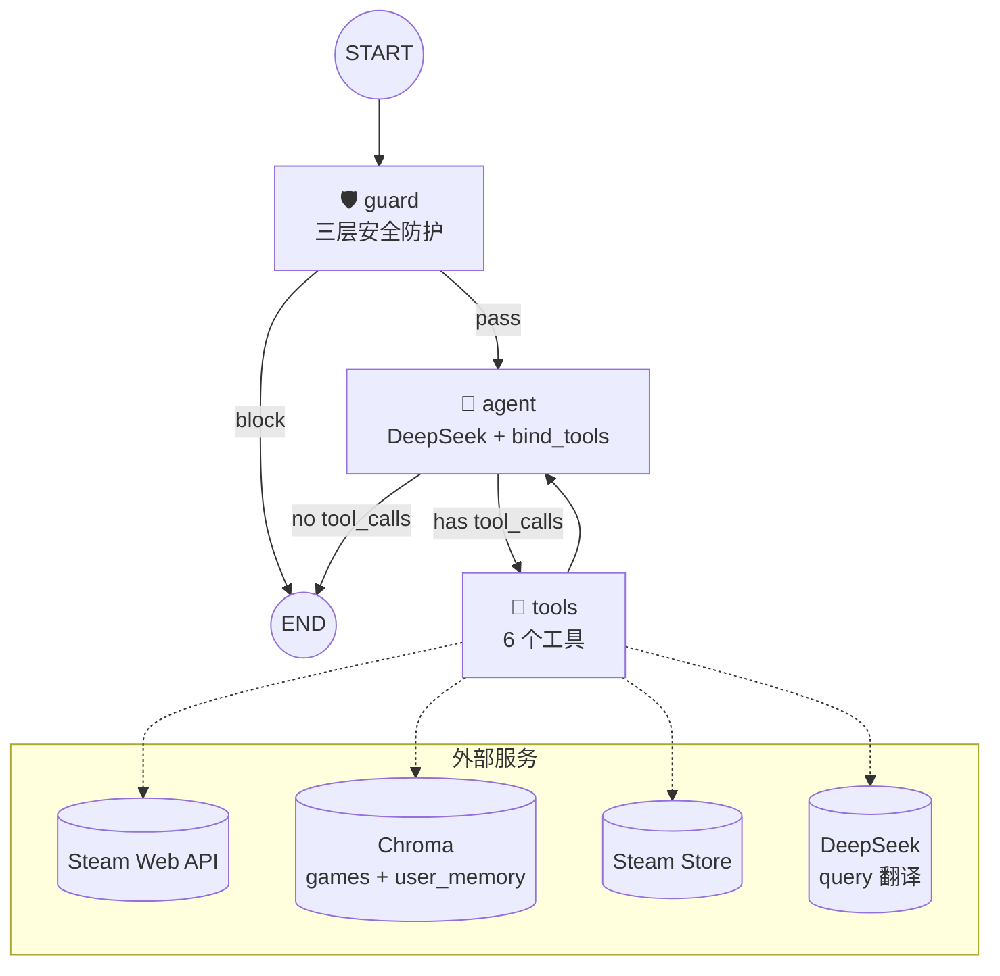

# 🎮 STEAM PLAY — Steam AI 游戏推荐 Agent

> 基于 LangGraph 的自主 Agent，结合 RAG 语义检索与用户记忆系统，提供个性化 Steam 游戏推荐。
> 不是固定流程的推荐引擎——Agent 自主决定何时调用什么工具、信息够了就停。
>
> 在线体验：[www.jiongplay.cn](https://www.jiongplay.cn)

## 架构



Agent 循环：LLM 收到工具结果后重新评估信息是否充分 → 不够就继续调工具 → 够了就输出推荐。完全自主决策，不设固定路径。

## 核心能力

- **自主工具调用** — Agent 动态决定工具调用的顺序和次数，不是写死的 if/else
- **RAG 语义检索** — 250 款游戏知识库，中文 query 自动翻译为英文再 embedding
- **用户记忆系统** — 结构化画像（偏好/约束/事实）自动注入 System Prompt + 对话历史语义召回
- **三层安全防护** — 正则规则（零成本）→ LLM 越狱检测 → LLM 边界分类，逐层拦截
- **流式响应** — SSE 逐 token 输出，工具执行时显示中文状态提示
- **匿名用户渐进引导** — 未绑定 Steam 时先做通用推荐，需要个性化时自然引导绑定

## 技术栈

| 层 | 选型 |
|---|---|
| Agent 框架 | LangGraph `StateGraph`（手写节点 + 条件边） |
| LLM | DeepSeek-Chat（主推理 + Query 翻译 + 安全分类） |
| Embedding | `BAAI/bge-base-en-v1.5`（本地 CPU 运行，零 API 成本） |
| 向量库 | Chroma（本地持久化，games + user_memory 双 collection） |
| 后端 | FastAPI + Uvicorn + SSE |
| 多轮对话 | LangGraph SqliteSaver（每 thread_id 状态隔离） |
| 结构化存储 | SQLite（画像、消息、认证、游戏档案缓存） |
| 可观测性 | LangSmith Tracing |
| 部署 | Docker + docker-compose |

## 快速开始

### 环境要求

- Python 3.11+
- Steam Web API Key（[获取地址](https://steamcommunity.com/dev/apikey)）
- DeepSeek API Key（[获取地址](https://platform.deepseek.com/)）

### 安装运行

```bash
# 克隆仓库
git clone <your-repo-url>
cd STEAM_Agent

# 创建虚拟环境
python -m venv .venv
source .venv/bin/activate  # Windows: .venv\Scripts\activate

# 安装依赖
pip install -r steam_agent/requirements.txt

# 配置环境变量
cp steam_agent/.env.example steam_agent/.env
# 编辑 .env 填入 STEAM_API_KEY 和 DEEPSEEK_API_KEY

# 构建游戏知识库（约 5-10 分钟，250 款游戏）
python -m steam_agent.rag.ingest

# 启动服务
python -m steam_agent.api.main
# 访问 http://localhost:8000
```

### Docker 部署

```bash
docker compose up -d
```

镜像构建默认用国内源，服务器部署时关掉：

```bash
docker compose build --build-arg USE_APT_MIRROR=false --build-arg PIP_INDEX=https://pypi.org/simple
```

## API

| 方法 | 路由 | 说明 |
|---|---|---|
| `POST` | `/chat` | 同步对话 |
| `POST` | `/chat/stream` | SSE 流式对话 |
| `GET` | `/threads` | 获取历史会话列表 |
| `GET` | `/messages` | 获取某会话的完整消息 |
| `DELETE` | `/threads` | 删除会话（四层级联删除） |
| `POST` | `/bind-steam` | 绑定 Steam ID |
| `GET` | `/steam-id` | 查询已绑定的 Steam ID |
| `POST` | `/auth/register` | 用户注册 |
| `POST` | `/auth/login` | 用户登录 |
| `GET` | `/health` | 健康检查 |

**请求示例：**

```json
POST /chat
{
    "thread_id": "th_abc123",
    "user_id": "player_one",
    "message": "根据我的游戏库推荐几款类似的游戏",
    "steam_id": "7656119XXXXXXXXXX"
}
```

## Agent 工具

| 工具 | 触发时机 |
|---|---|
| `get_user_playtime` | 需要了解用户偏好时，调用 Steam API 获取游戏库 |
| `rag_search_similar_games` | 语义推荐、"类似 XXX"、"找 YYY 类型"，每轮最多调一次 |
| `search_steam_store` | 查价格/在售状态/评分，或 RAG 无结果时降级 |
| `save_user_insight` | Agent 主动发现偏好/约束/事实时自动保存，用户无感知 |
| `recall_user_memory` | 模糊回忆历史对话（"之前聊过的那个卡牌游戏"） |
| `recall_message_detail` | 精确查询某轮对话的完整内容 |

## 记忆架构

```
┌── 短期记忆 ────────────────────────────┐
│  LangGraph Checkpointer (SqliteSaver) │
│  当前对话上下文，thread_id 隔离        │
└───────────────────────────────────────┘

┌── 长期记忆 ──────────────────────────────────────────┐
│                                                       │
│  ① 结构化画像 (user_insights / SQLite)                │
│     Agent 主动保存偏好/约束/事实                       │
│     → 新会话自动注入 System Prompt（免费获取）          │
│                                                       │
│  ② 对话记忆 (user_memory / Chroma)                    │
│     每轮对话自动归档，embedding 后写入                  │
│     → Agent 按需通过 recall_user_memory 检索           │
│                                                       │
│  ③ 游戏档案 (user_game_profile / SQLite + 内存缓存)    │
│     三级缓存，6h TTL，注入 System Prompt               │
│                                                       │
└───────────────────────────────────────────────────────┘
```

## 安全防护

```
用户消息 → Layer 1 (正则) → Layer 2 (越狱检测) → Layer 3 (边界分类) → Agent
                │                │                  │
                ▼                ▼                  ▼
           注入标记/零宽     角色劫持/提示词      越权请求/成人内容/
           字符/威胁/敏感词   泄露/DAN攻击        政治话题/代码生成
              ~0ms            ~500ms             ~500ms
```

Layer 1 只拦截确定性攻击（不会误杀），Layer 2 和 Layer 3 通过 temperature=0 的 LLM 做语义判断。游戏语境下的"杀怪"不会被误判为暴力威胁。

## 项目结构

```
steam_agent/
├── api/                  # FastAPI 入口
│   ├── main.py           # app 创建、lifespan
│   ├── routes.py         # /chat, /chat/stream, 历史/认证 API
│   └── schemas.py        # Pydantic 请求/响应模型
│
├── graph/                # LangGraph Agent 核心
│   ├── state.py          # AgentState 定义
│   ├── builder.py        # StateGraph 构建（节点 + 条件边）
│   └── nodes.py          # guard_node / agent_node / tool_node 实现
│
├── tools/                # Agent 可调用的 6 个工具
│   ├── playtime.py       # Steam API 游戏库查询
│   ├── rag_search.py     # Chroma 语义检索（含翻译 + 混合过滤）
│   ├── store_search.py   # Steam 商店搜索
│   ├── user_insight.py   # 用户画像持久化
│   ├── user_memory.py    # 对话记忆语义召回
│   └── recall_message_detail.py  # 结构化消息精确回溯
│
├── memory/               # 数据持久化层
│   ├── insight_store.py  # 用户画像 CRUD
│   ├── archiver.py       # 对话归档（Chroma + SQLite 双写）
│   ├── message_store.py  # 消息 SQLite 存储 + 四层级联删除
│   ├── game_profile.py   # 游戏档案三级缓存
│   ├── auth.py           # 用户注册/登录/Steam 绑定
│   └── thread_title.py   # 会话标题自动生成
│
├── rag/                  # RAG 管线
│   ├── embedder.py       # BGE embedding 封装
│   ├── translate.py      # DeepSeek query 中译英
│   ├── vector_store.py   # Chroma 读写（games + user_memory）
│   ├── ingest.py         # 离线数据摄入（全量/增量/缓存重建）
│   └── chroma_data/      # Chroma 持久化 + game_cache.json
│
├── guard/                # 三层安全防护
│   ├── layer1_rules.py   # 正则规则（注入/编码/威胁/敏感词）
│   ├── layer2_intent.py  # LLM 越狱意图分类
│   └── layer3_scope.py   # LLM 职责边界分类
│
├── prompts/
│   └── system.py         # System Prompt 构建（含画像注入）
│
├── tests/                # 测试与评测
│   ├── runner.py         # 评测 runner
│   ├── llm_judge.py      # LLM-as-Judge 评分
│   └── ...
│
├── static/
│   └── index.html        # 前端 SPA（赛博朋克风格）
│
└── config.py             # 环境变量 + 全局配置
```

## 关键设计决策

- **手写 Agent 循环而非 `create_react_agent`** — 展示对底层机制（消息循环、条件路由）的掌握
- **RAG 作为 Tool 而非 Pipeline** — Agent 自主决定何时检索、检索什么，而非每次请求都跑一遍
- **不缓存 Steam API** — 10 万次/天的限额远高于实际使用量，增加缓存只增加复杂度
- **Embedding 本地运行** — `bge-base-en-v1.5` 在 CPU 上运行，零 API 成本
- **中文 query → 英文检索** — 用 DeepSeek 将中文 query 翻译为英文关键词，弥合语言鸿沟

## License

MIT
