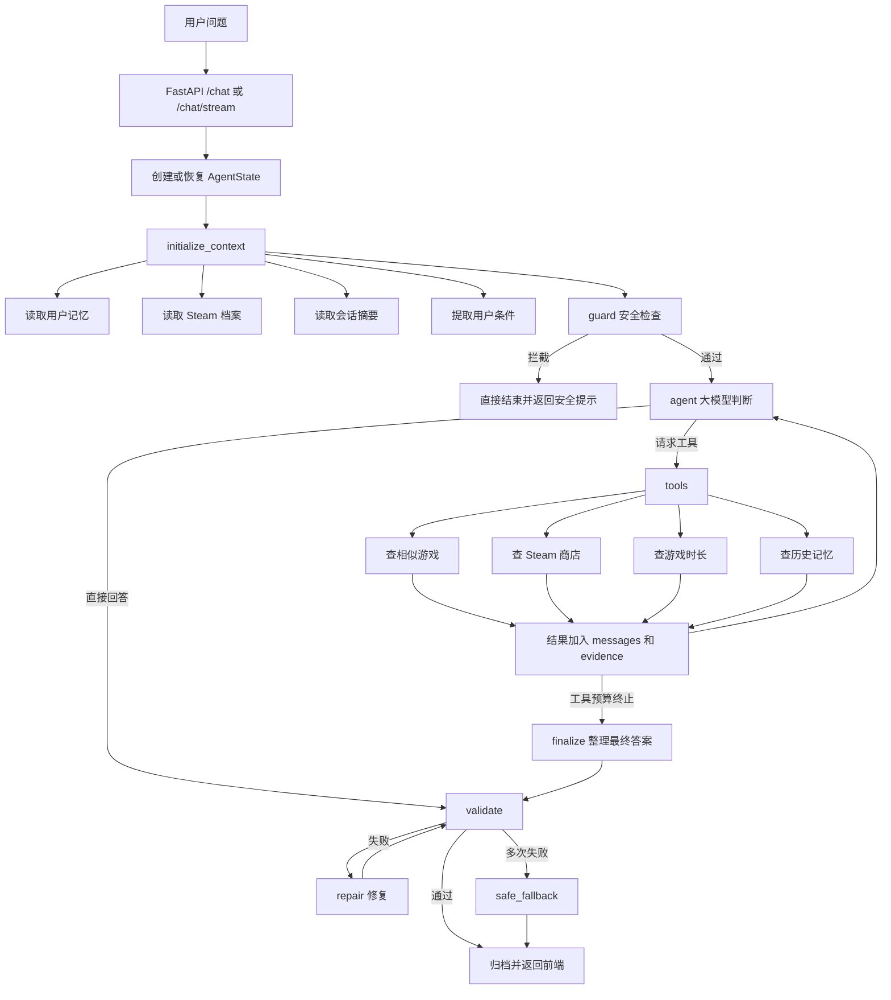

# STEAM Agent

STEAM Agent 是面向 Steam 玩家的 AI 游戏发现助手。它把自然语言需求、Steam 档案、游戏知识库和历史记忆组合起来，输出带证据约束的个性化推荐，并通过 SSE 展示真实的 Agent 节点阶段。

在线体验：**[https://jiongplay.cn](https://jiongplay.cn)**

## 首页截图

当前正式前端入口是 `night-museum-frontend/index.html`，后端启动后会直接托管该页面。以下为未登录首页预览，登录和 Steam 绑定不是浏览首页的前置条件。

首页截图尚未保存为仓库图片文件；可通过上方在线地址查看当前页面。

## 完整运行流程


```mermaid
flowchart TD
    A[用户问题] --> B[FastAPI /chat 或 /chat/stream]
    B --> C[创建或恢复 AgentState]
    C --> D[initialize_context]
    D --> D1[读取用户记忆]
    D --> D2[读取 Steam 档案]
    D --> D3[读取会话摘要]
    D --> D4[提取用户条件]
    D --> E[guard 安全检查]
    E -->|拦截| Z[直接结束并返回安全提示]
    E -->|通过| F[agent 大模型判断]
    F -->|直接回答| G[validate]
    F -->|请求工具| H[tools]
    H --> H1[查相似游戏]
    H --> H2[查 Steam 商店]
    H --> H3[查游戏时长]
    H --> H4[查历史记忆]
    H1 --> I[结果加入 messages 和 evidence]
    H2 --> I
    H3 --> I
    H4 --> I
    I --> F
    I -->|工具预算终止| J[finalize 整理最终答案]
    J --> G
    G -->|通过| K[归档并返回前端]
    G -->|失败| L[repair 修复]
    L --> G
    G -->|多次失败| M[safe_fallback]
    M --> K
```

四类对外阶段由真实内部节点事件驱动：`analysis`、`retrieval`、`validation`、`response`。每个节点开始和完成时发送 `started` / `completed`，前端不再使用固定时间动画模拟进度。

## 文件架构

```text

├─ 
├─ api/                  # FastAPI 接口、SSE、认证和静态前端挂载
├─ graph/                # LangGraph 节点、AgentState 和条件路由
├─ guard/                # 分层安全检查和范围控制
├─ memory/               # 用户记忆、会话摘要、消息归档和标题
├─ rag/                  # Steam 游戏缓存、向量检索、混合检索和重排
├─ tools/                # 相似游戏、商店、游玩时长和历史记忆工具
├─ prompts/              # 系统提示词、工具策略和 JSON 输出规范
├─ night-museum-frontend/
│  ├─ index.html         # 当前正式首页
│  ├─ app.js             # SSE 消费、对话状态和推荐卡片渲染
│  ├─ styles.css         # 页面基础样式
│  ├─ generated-images/  # 推荐卡片视觉资源
├─ config.py             # 环境变量、模型和运行参数
├─ llm_client.py         # DeepSeek/custom OpenAI 兼容客户端
├─ model_routing.py      # 快速模型和候选模型选择
├─ requirements.txt      # Python 运行依赖
├─ tests/                # 单元、接口和 RAG 测试
├─ docs/                    # API、部署、前端和评测文档
└─ README.md                # 项目总览和部署入口
```

## Agent 基础介绍与应用场景

Agent 不是一次性调用模型，而是围绕 `AgentState` 进行可恢复的多轮决策：先读取上下文，再判断是否需要工具；工具结果会进入 `messages` 和 `evidence`，最后经过校验、修复或安全兜底后返回。

- **模糊偏好探索**：从“像某款游戏但更短、更轻松”等描述中提取条件。
- **Steam 档案推荐**：结合已拥有游戏、游玩时长和长期偏好减少重复推荐。
- **相似游戏发现**：从知识库检索题材、玩法和氛围相近的候选。
- **约束型选购**：按多人、价格、平台、时长、语言或发行状态筛选。
- **连续对话**：在同一会话中逐步补充偏好，读取摘要后继续判断。

## 本地运行

```powershell
git clone https://github.com/jiongwang114/git
cd STEAM_Agent
python -m venv .venv
.venv\Scripts\activate
pip install -r requirements.txt
Copy-Item .env.example .env
python -m api.main
```

后端默认监听 `http://localhost:8000`，并托管当前正式前端；健康检查为 `/health`，就绪检查为 `/ready`，交互式 API 文档为 `/docs`。首次使用 RAG 时可执行 `python -m rag.ingest --from-cache` 构建本地索引。

## 模型配置

在 `.env` 中通过 `LLM_PROVIDER` 切换厂商：`custom` 使用 `CUSTOM_LLM_MODEL`、`CUSTOM_LLM_BASE_URL` 和 `CUSTOM_LLM_API_KEY`；`deepseek` 使用 `LLM_MODEL`、`DEEPSEEK_BASE_URL` 和 `DEEPSEEK_API_KEY`。修改后重启后端即可生效。

## 常用接口和测试

- `POST /chat`：同步对话
- `POST /chat/stream`：SSE 流式对话
- `GET /chat/runs/{thread_id}`：恢复运行中的流
- `/auth/*`、`/bind-steam`：认证和 Steam 绑定
- `/threads`、`/messages`：会话和消息记录
- `/health`、`/ready`、`/metrics`：健康、就绪和指标

```bash
pytest -q tests
```

更多说明见 [`docs/API_CONTRACT.md`](docs/API_CONTRACT.md)、[`docs/BACKEND_DEPLOYMENT.md`](docs/BACKEND_DEPLOYMENT.md) 和 [`docs/FRONTEND_DESIGN.md`](docs/FRONTEND_DESIGN.md)。
