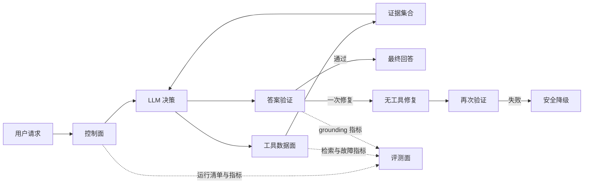

# Agent 工程化设计

这个项目把大模型视为一个有随机性的决策组件，而不是整个系统本身。模型负责理解意图、选择工具和组织语言；确定性代码负责预算、执行、证据、降级、持久化和验收。



## 1. 控制面：保证每次运行有完整结束

Prompt 只能表达期望，不能保证模型遵守。真正的上限由代码执行：

- 总 token 预算、wall-clock deadline、工具轮次和单轮调用数。
- 相同工具和参数禁止重复；单工具有独立配额。
- LLM、工具和 API 入口各有 timeout，避免只限制某一层。
- 预算耗尽进入不绑定工具的 finalize，而不是留下半截 tool call。
- 每次结束都带 `termination_reason`，区分 completed、deadline、token_budget、tool_budget 和 insufficient_evidence。

工程思维是：任何循环都要同时有次数上限、时间上限、成本上限和退出后的用户语义。

## 2. 工具契约：把故障变成 Agent 能理解的状态

所有工具结果统一成 `ToolResult`：

- `success`：有可用数据。
- `empty`：调用成功但没有业务结果，不能当异常重试。
- `invalid_input`：参数错误，重试没有意义。
- `timeout / rate_limited / upstream_error`：依错误可恢复性有限重试。
- `policy_blocked / unknown_tool`：确定性策略拒绝。

工具执行器只对幂等、可恢复错误最多重试一次。连续失败达到阈值后熔断；冷却期内直接返回 `circuit_open`。同一工具返回 empty 后，即使模型换关键词也不会再次执行。这里的重点不是“捕获所有异常”，而是让每种失败拥有明确、可测试的下一步。

## 3. 证据闭环：模型不能把流畅当正确

工具成功结果会抽取成 EvidenceItem，记录来源、appid 和实际支持的字段。最终答案要经过验证：

- Steam appid 必须存在于本轮证据。
- 人民币原价和现价必须匹配对应 appid 的价格证据。
- 内部 DSML/tool protocol 不能泄露到最终文本。
- 首次失败只允许一次无工具 repair；再次失败返回固定的 insufficient-evidence 降级答复。

这是一种“生成后验证”架构。验证器只检查能确定判断的事实，不假装能用正则理解整篇自然语言。

## 4. RAG：检索质量必须可分解

检索链路是 Dense + BM25 + RRF + CrossEncoder：

1. Dense 负责语义相似。
2. BM25 负责游戏专名、短关键词和精确词命中。
3. RRF 融合两个不同分数空间中的排名。
4. 本地 CrossEncoder 对候选重排。
5. 元数据过滤在候选阶段执行，保证免费、年份、多人和评分约束。

评测使用人工复核的 graded qrels，报告 Recall@10、Precision@10、MRR、nDCG、constraint accuracy 和 hard-negative rate。翻译、dense、lexical、fusion、rerank、总链路分别计时；查询翻译和 embedding 使用内容寻址缓存；索引 manifest 记录数据 hash、模型、文档版本和规模。

当前 reviewed gate 基线：test Recall@10 0.405、MRR 0.593、nDCG 0.365，过滤准确率 1.0，hard-negative rate 0。它不是漂亮数字，而是下一次优化必须击败的可重复参照。

## 5. 记忆：写入质量比“记得多”更重要

长期画像记录 insight、category、normalized key、polarity、confidence、source、scope、TTL、active 和 superseded_by。

- 语义重复合并，不无限追加。
- 同主题的新偏好使旧记录失活，同时保留替代关系。
- stable、temporary、session 使用不同有效期。
- 显式用户陈述与模型推断拥有不同来源和置信度。
- Prompt 只注入有效、未过期、置信度最高的前 12 条。

Memory gate 覆盖重复、冲突、独立事实、TTL、置信度排序和注入预算。当前 20/20，precision/recall 均为 1.0，contradiction rate 为 0。

## 6. 评测面：每次修改都要能回答“提升了多少”

评测分四层：

- 单元/集成测试：确定性规则，快且免费。
- robustness gate：注入 timeout、限流、连接失败、参数错误、empty、deadline 和熔断。
- reviewed RAG/Memory gate：固定数据和索引，量化数据面。
- paid Agent gate：真实 DeepSeek + 固定工具 fixture，20 个 case 重复 3 次。

RunManifest 固定 git SHA、模型参数、Prompt hash、dataset hash、index hash 和重复次数。报告同时输出 JSON、Markdown 和 JUnit。基线只能显式 promote，候选运行不能自动覆盖。

Prompt v2 对同一模型和同一 20 条数据的单次对照结果：成功率 55% -> 75%，P95 38.79s -> 7.04s，平均 token 11,275 -> 4,008。最终 3 次重复基线为成功率 95%、工具链成功率 96.7%、P95 6.97s、平均 token 4,795；预算违规、重复外部调用和无证据推荐均为 0。

## 7. 本地验证

```bash
python -m unittest discover -s tests -p "test_*.py" -v
python -m evals.cli validate
python -m evals.cli run-robustness
python -m evals.cli run-memory
python -m evals.cli run-retrieval
python -m evals.cli run-agent --repeats 3
python -m evals.cli compare --candidate evals/reports/agent.json --baseline evals/baselines/agent-v2.1.json
```

普通 CI 执行免费确定性门禁；PR 质量工作流执行完整付费 Agent gate 和 reviewed hybrid RAG gate。工程上的完整闭环是：改动 -> 同条件运行 -> 报告差异 -> 审核失败 case -> 显式提升基线，而不是看到几个好例子就宣布完成。
