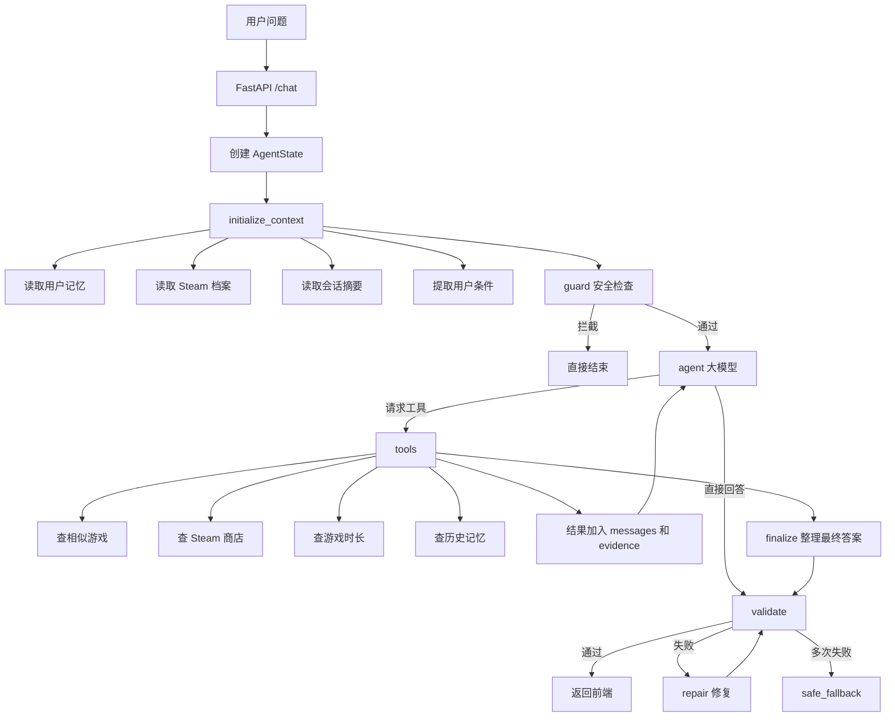

# Steam Agent

Steam Agent 是一个面向 Steam 玩家发现新游戏的 AI 推荐应用。它把用户的自然语言问题、Steam 档案、游戏知识库和历史记忆结合起来，给出带证据约束的推荐结果，并通过实时事件流展示 Agent 的执行阶段。

在线体验：**[https://jiongplay.cn](https://jiongplay.cn)**

## 首页预览

当前正式前端入口是 `night-museum-frontend/index.html`，后端启动后会直接托管该页面。下面是未登录状态的首页预览；登录和 Steam 绑定都不是浏览首页所必需的。


页面采用“夜班展厅”视觉主题，用户可以直接输入想玩的类型、氛围、时长或类似游戏，随后再按需登录并绑定 Steam 账号以获得个性化推荐。

## Agent 工作流程



实时 SSE 阶段事件把内部节点归并为四个稳定类别：`analysis`、`retrieval`、`validation`、`response`。每个节点开始和完成时分别发送 `started` 与 `completed`，前端不依赖定时动画推进阶段。

## 文件架构

```text
steam_agent/
├─ api/
│  ├─ main.py              # FastAPI 应用、静态前端挂载、生命周期
│  ├─ routes.py            # /chat、SSE、会话和认证接口
│  └─ schemas.py           # 请求、响应和流事件模型
├─ graph/
│  ├─ builder.py           # LangGraph 节点和路由
│  ├─ nodes.py             # initialize_context、agent、tools、validate 等节点
│  ├─ state.py              # AgentState 定义
│  └─ constraints.py        # 用户条件和证据约束
├─ guard/                  # 多层安全检查
├─ memory/                 # 用户记忆、会话摘要和归档
├─ rag/                    # Steam 游戏知识库、向量检索和重排
├─ tools/                  # Steam 商店、游戏时长、相似游戏等工具
├─ prompts/                # 系统提示词和输出格式约束
├─ night-museum-frontend/
│  ├─ index.html            # 当前正式首页
│  ├─ app.js                # 前端状态、SSE 消费和推荐渲染
│  ├─ styles.css            # 页面基础样式
│  └─ generated-images/     # 推荐卡片视觉资源
├─ config.py               # 环境变量和模型配置
├─ llm_client.py           # DeepSeek/custom OpenAI 兼容客户端
├─ model_routing.py        # 快速模型和候选模型路由
├─ docs/                   # API 契约、设计和测试文档
└─ tests/                  # 自动化测试
```

## 主要应用场景

- **模糊偏好探索**：用户只知道想找“像某款游戏但更短、更轻松”的作品。
- **基于 Steam 档案推荐**：结合已拥有游戏、游玩时长和用户记忆，减少重复推荐。
- **相似游戏发现**：从游戏知识库检索题材、玩法、氛围相近的候选。
- **约束型选购**：根据多人、价格、平台、时长、语言或发行状态筛选。
- **连续对话**：在同一会话中逐步补充偏好，Agent 读取摘要后继续判断。

## 本地运行

在仓库父目录 `F:\STEAM_Agent` 执行：

```powershell
python -m steam_agent.api.main
```

后端默认监听 `http://localhost:8000`，并托管前端页面。若只调试静态前端，也可以执行：

```powershell
python -m http.server 5173 -d steam_agent/night-museum-frontend
```

## 模型配置

通过根目录 `.env` 切换模型厂商。custom 使用 `CUSTOM_LLM_MODEL`、`CUSTOM_LLM_BASE_URL` 和 `CUSTOM_LLM_API_KEY`；DeepSeek 使用 `LLM_MODEL`、`DEEPSEEK_BASE_URL` 和 `DEEPSEEK_API_KEY`。修改后重启后端即可生效。

## 相关文档

- [API 契约](docs/API_CONTRACT.md)
- [前后端技术文档](docs/后端与前端实施技术文档.md)
- [前端设计说明](docs/FRONTEND_DESIGN.md)
